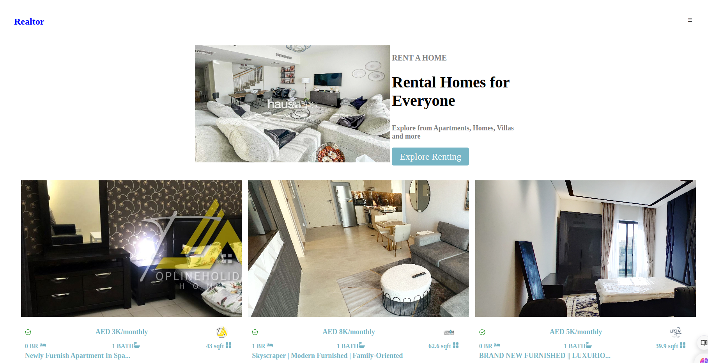

# Realtor App

## Table of Contents

- [Description](#description)
- [Preview](#preview)
- [Features](#features)
- [Folders](#folders)
- [Files](#files)
- [Installation and Usage](#installation-and-usage)
- [Technologies Used](#technologies-used)
- [External APIs](#external-apis)
- [Acknowledgement](#acknowledgement)
- [MIT License](#mit-license)
- [Author](#author)
- [Contacts](#contacts)
- [Other](#other)

## Description

The Realtor App is a web-based platform designed to streamline the process of buying, selling, and renting properties. It provides users with a user-friendly interface to search for properties, view property details, schedule appointments, and connect with real estate agents.

## Preview

<!-- Add a link to a preview of your project here -->

## Features

- **Listing Display**: Display the search results as a list of properties, showing key information such as property address, price, number of bedrooms/bathrooms, square footage, and a thumbnail image.
- Detailed property listings with high-quality images, descriptions, and amenities
- **Search**: Implement a search feature where users can search for properties based on criteria such as location, price range, number of bedrooms/bathrooms, property type (e.g., house, apartment, condo), e.
- **Listing Display**: Display the search results as a list of properties, showing key information such as property address, price, number of bedrooms/bathrooms, square footage, and a thumbnail image.
- **Property Details**: Allow users to click on a listing to view more detailed information about the property, including additional images, property descriptions, amenities, and contact information for the listing agent.
- **filtering Options**: Provide filtering options to refine search results further, such as filtering by property status (e.g., for sale, for rent), property features (e.g., pool, garage), and listing attributes (e.g., new construction, open house)

## Folders

- **/src**: Contains the source code files for the application.
- **/public**: Stores static assets such as images, fonts, and icons.

## Files

- **app.js**: Main entry point of the application.
- **index.html**: HTML template for the home page.
- **style.css**: CSS stylesheet for styling the application.
- **server.js**: Backend server implementation using Node.js and Express.js.

## Installation and Usage

1. Clone the repository: `git clone git@github.com:ahabab23/Realtor-App-Project.git`
2. Navigate to the project directory: `cd realtor-app`
3. Install dependencies: `npm install`
4. Start the server: `node server.js`
5. Open the app in your web browser: `http://localhost:3000`

## Technologies Used

- HTML5
- CSS3
- JavaScript
- Node.js
- React

## External APIs

The Realtor App integrates with the following external APIs:

[Rapid Api](https://rapidapi.com/apidojo/api/bayut).

## Acknowledgement

1 would like to thank the following resources for their valuable insights and inspiration:

- Stack Overflow community for troubleshooting assistance.
- Rapid Api, where the Api for this project is obtained.

## MIT License

This project is licensed under the terms of the MIT License. See the [LICENSE](LICENSE) file for more details.

## Author

- Uwes Ahabab

## Contacts

For any inquiries or feedback, please contact us at:

- Email: contact@realtorapp.com
- Phone: +(254),723867116

## Other

- For deployment instructions, refer to the [DEPLOYMENT.md](DEPLOYMENT.md) file.
- Follow us on social media for updates and announcements.
